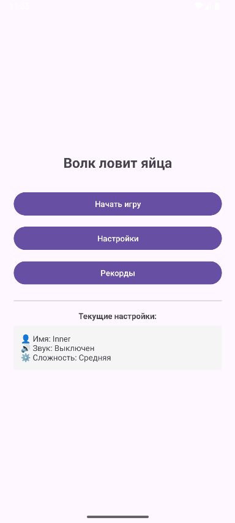
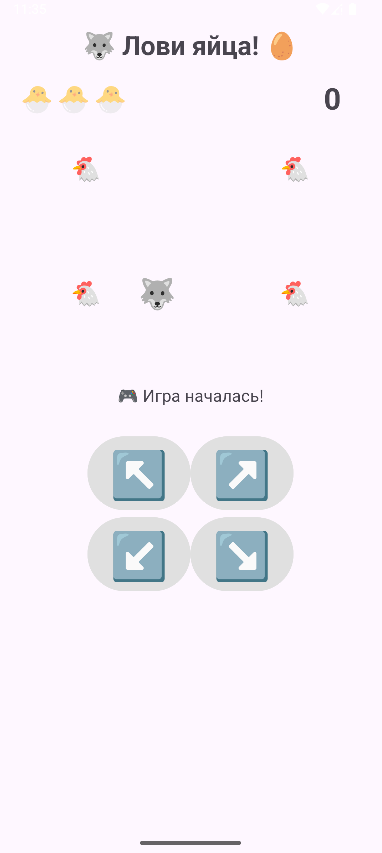
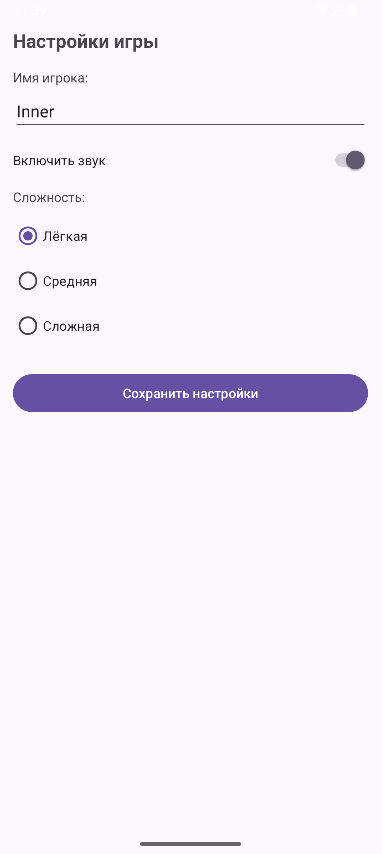
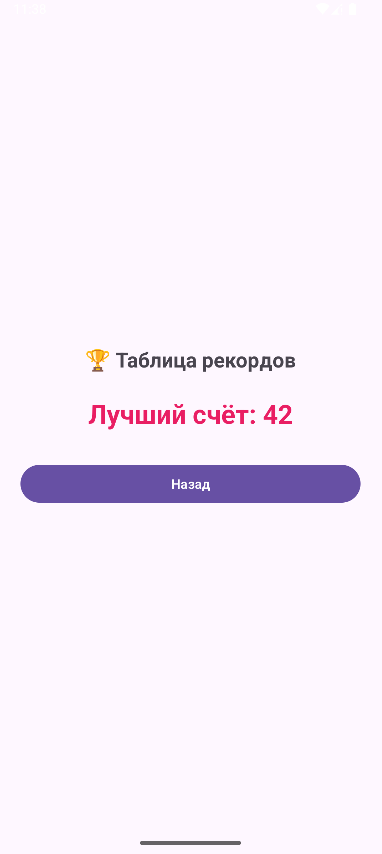

<div align="center">

# Отчёт

</div>

<div align="center">

## Практическая работа №12

</div>

<div align="center">

## Типы активностей. Шаблоны Android Studio. Сохранение настроек с SharedPreferences.

</div>

**Выполнил:** Деревянко Артём Владимирович<br>
**Курс:** 2<br>
**Группа:** ИНС-б-о-24-2<br>
**Направление:** 09.03.02 Информационные системы и технологии<br>
**Проверил:** Потапов Иван Романович

---

### Цель работы
Изучить различные типы шаблонов активностей, предоставляемых Android Studio. Научиться создавать многоэкранные приложения с использованием разных видов окон. Освоить механизм сохранения простых пользовательских настроек с помощью SharedPreferences.

### Ход работы
##### Задание 1: Создание проекта и изучение шаблонов
1. Был открыт Android Studio и создан новый проект с шаблоном **Empty Views Activity**. Проекту дано имя `MultiWindowApp`.
2. Изучена структура проекта, файл `activity_main.xml` и `MainActivity.java`.

##### Задание 2: Добавление различных типов активностей
В проект было добавлено несколько активностей разных типов согласно варианту 11 ("Волк ловит яйца"):  главный экран, экран игры, экран с настройками, экран с рекордами.

##### Задание 3: Настройка переходов между окнами
1. На главном экране созданы кнопки для перехода к другим активностям.
2. В `MainActivity.java` реализованы обработчики нажатий с использованием `Intent`.
##### Настройка переходов
```java
btnGame.setOnClickListener(v -> {
    Intent intent = new Intent(MainActivity.this, GameActivity.class);
    startActivity(intent);
});

btnSettings.setOnClickListener(v -> {
    Intent intent = new Intent(MainActivity.this, SettingsActivity.class);
    startActivity(intent);
});

btnRecords.setOnClickListener(v -> {
    Intent intent = new Intent(MainActivity.this, RecordsActivity.class);
    startActivity(intent);
});
```

##### Задание 4: Работа с SharedPreferences (на примере экрана настроек)
Использован шаблон **Settings Activity**.
```xml
<?xml version="1.0" encoding="utf-8"?>
<PreferenceScreen xmlns:app="http://schemas.android.com/apk/res-auto">

    <EditTextPreference
        app:key="player_name"
        app:title="Имя игрока"
        app:summary="Введите ваше имя"
        app:useSimpleSummaryProvider="true"
        app:defaultValue="Игрок"/>

    <SwitchPreferenceCompat
        app:key="sound_enabled"
        app:title="Звук"
        app:summary="Включить звуковые эффекты"
        app:defaultValue="true"/>

    <ListPreference
        app:key="difficulty"
        app:title="Сложность"
        app:summary="Выберите уровень сложности"
        app:entries="@array/difficulty_entries"
        app:entryValues="@array/difficulty_values"
        app:defaultValue="Средняя"
        app:useSimpleSummaryProvider="true"/>

</PreferenceScreen>
```
Сводка выносится на главный экран в виде `TextView`

#### Результат
<br>
<br>
<br>


### Вывод
В результате выполнения практической работы были изучены различные типы шаблонов активностей, предоставляемых Android Studio. Получены навыки создания многоэкранных приложений с использованием разных видов окон. Освоен механизм сохранения простых пользовательских настроек с помощью SharedPreferences.

### Ответы на контрольные вопросы
1. **Какие шаблоны активностей предоставляет Android Studio? Кратко опишите назначение 3-4 из них.**<br>
Android Studio предоставляет множество шаблонов: Empty Activity, Basic Activity, Bottom Navigation Activity, Navigation Drawer Activity, Settings Activity, Login Activity, Scrolling Activity, Fullscreen Activity, Tabbed Activity, Google Maps Activity.<br>
**Empty Activity** — пустая активность с минимальным набором файлов, подходит для любых целей.<br>
**Basic Activity** — включает AppBar, FloatingActionButton и отдельный файл контента.<br>
**Settings Activity** — генерирует экран настроек с использованием PreferenceFragmentCompat.<br>
**Bottom Navigation Activity** — создаёт нижнюю навигационную панель для переключения между фрагментами.

---

2. **Для чего используется SharedPreferences? Какие типы данных можно в нём хранить?**<br>
**SharedPreferences** — механизм для хранения небольших объёмов данных в виде пар «ключ-значение». Используется для сохранения настроек приложения, состояния и простых пользовательских данных.<br>
**Можно хранить:**
- String (строки)
- int (целые числа)
- boolean (логические значения)
- float (числа с плавающей точкой)
- long (длинные целые)
- Set<String> (наборы строк)

---

3. **В чём разница между методами getPreferences(), getSharedPreferences() и PreferenceManager.getDefaultSharedPreferences()?**<br>
**getPreferences(MODE_PRIVATE)** — используется для получения SharedPreferences, доступных только в рамках одной активности.<br>
**getSharedPreferences("name", MODE_PRIVATE)** — позволяет получить общие настройки для всего приложения с указанным именем файла.<br>
**PreferenceManager.getDefaultSharedPreferences(context)** — возвращает стандартный файл SharedPreferences, используемый Settings Activity (имя формируется автоматически как `<package_name>_preferences`).

---

4. **Как записать данные в SharedPreferences? Объясните разницу между apply() и commit().**<br>
Запись данных:
```java
SharedPreferences.Editor editor = prefs.edit();
editor.putString("key", "value");
editor.putInt("age", 25);
editor.apply(); // или commit()
```
**apply()** — асинхронная запись, не возвращает результат, выполняется в фоновом потоке. Рекомендуется использовать в большинстве случаев.<br>
**commit()** — синхронная запись, возвращает boolean (успех/неудача), выполняется в UI-потоке и может вызвать задержки.

---

5. **Как прочитать данные из SharedPreferences? Для чего нужно значение по умолчанию?**<br>
Чтение данных:
```java
SharedPreferences prefs = getSharedPreferences("MyApp", MODE_PRIVATE);
String name = prefs.getString("user_name", "Не указано");
int age = prefs.getInt("user_age", 0);
boolean isLoggedIn = prefs.getBoolean("is_logged_in", false);
```
**Значение по умолчанию** возвращается, если ключ не найден в SharedPreferences. Это позволяет избежать ошибок и обеспечить корректную работу приложения при первом запуске или отсутствии сохранённых данных.

---

6. **Как создать экран настроек с использованием шаблона Settings Activity? Где описываются элементы настроек?**
1. Щёлкнуть правой кнопкой на пакете → New → Activity → Settings Activity
2. Ввести имя активности (например, SettingsActivity)
3. Нажать Finish<br>
Элементы настроек описываются в XML-файле **res/xml/root_preferences.xml**:
```xml
<PreferenceScreen xmlns:app="http://schemas.android.com/apk/res-auto">
    <EditTextPreference
        app:key="player_name"
        app:title="Имя игрока"
        app:useSimpleSummaryProvider="true"/>
    <SwitchPreference
        app:key="sound_enabled"
        app:title="Звук"
        app:defaultValue="true"/>
</PreferenceScreen>
```

---

7. **Как организовать переход между активностями с помощью Intent?**<br>
**Простой переход:**
```java
Intent intent = new Intent(MainActivity.this, SettingsActivity.class);
startActivity(intent);
```

**Переход с ожиданием результата:**
```java
Intent intent = new Intent(MainActivity.this, GameActivity.class);
startActivityForResult(intent, REQUEST_CODE);
```
Intent — это объект, который содержит информацию о целевой активности и используется системой для её запуска.

---

8. **Что такое FloatingActionButton и в каких шаблонах он присутствует?**<br>
**FloatingActionButton (FAB)** — круглая плавающая кнопка, которая располагается в правом нижнем углу экрана и используется для выполнения основного действия на экране.<br>
**Присутствует в шаблонах:**
- Basic Activity
- Navigation Drawer Activity
- Bottom Navigation Activity (в некоторых версиях)<br>
FAB автоматически позиционируется поверх контента и имеет анимацию нажатия.